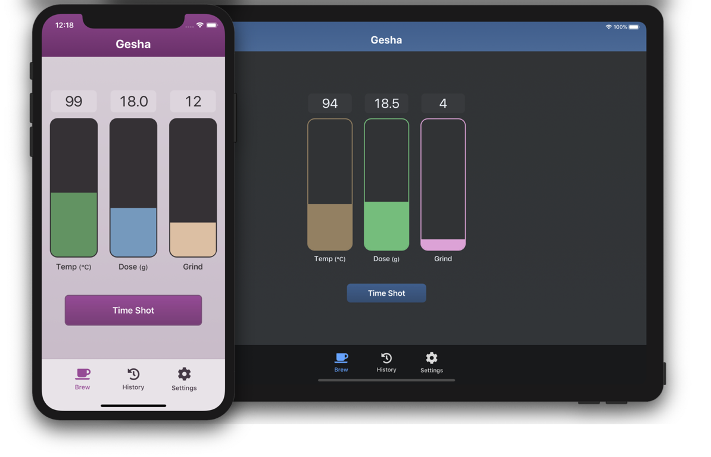

# Gesha

Gesha is an app for your modded espresso machine. It integrates with a [MAX31855](https://www.adafruit.com/product/3328) and a relay to control brew temperature, and lets you track variables like dose, grind, ratio, etc. to make perfecting your espresso easier.

## Features

- [x] Zero dependencies
- [x] Fast and Accessible Web App
- [x] Fully documented REST API
- [x] Support for Internationalization
- [x] Builds for ARM64, ARM, x86, and x86_64
- [x] Real-time streaming of temperature and PID output using lightweight [Event Streams](https://html.spec.whatwg.org/multipage/iana.html#text/event-stream)

## Installation

1. Download the latest [release](https://github.com/LukeChannings/gesha/releases) for your architecture
2. Move the download to your desired server and run `sudo ./gesha install`
3. Use `sudo systemctl enable gesha` to make sure Gesha runs on boot
4. `sudo systemctl daemon-reload` `sudo systemctl start gesha`

The install command will copy the binary into `/usr/local/`, install a systemd unit, and a default configuration file.

> If you do not have a distribution that uses systemd, you can run gesha directly with `./gesha start`.

## Supporting documents & prior works

- [silvia-pi](https://github.com/brycesub/silvia-pi)
- [Silvia PID manual](https://www.seattlecoffeegear.com/assets/files/silvia-pid-operation-manual.pdf)
- [PID without a PhD](https://m.eet.com/media/1112634/f-wescot.pdf)
- [Rancilio Silvia User Manual](https://www.ranciliogroupna.com/filebin/images/Downloadables/User_Manuals/Homeline/Silvia_User_Manual_2017.PDF) (vector electrical diagrams from page 32)
