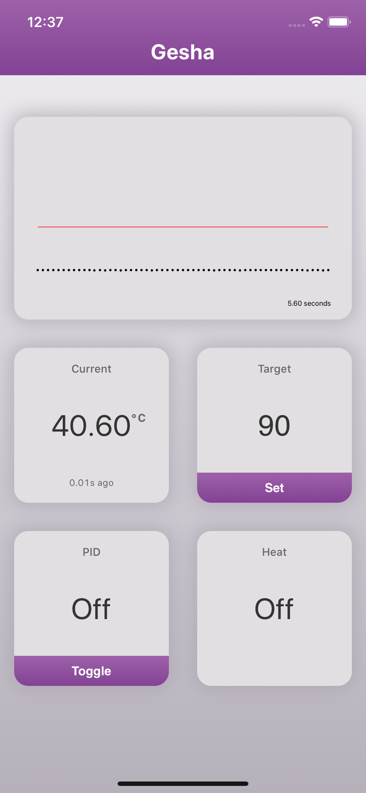
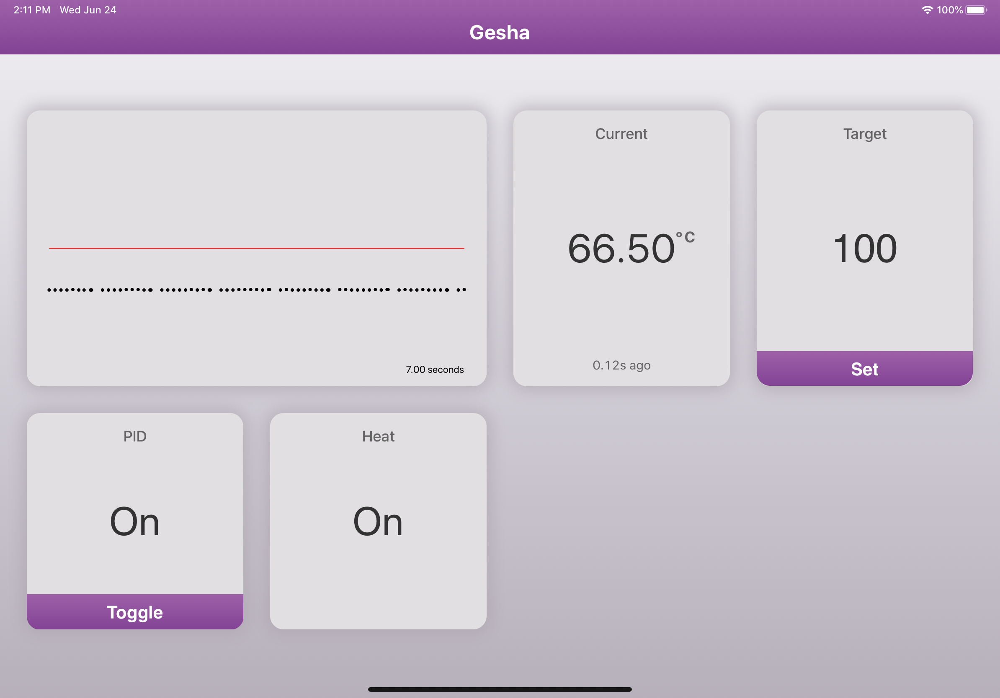
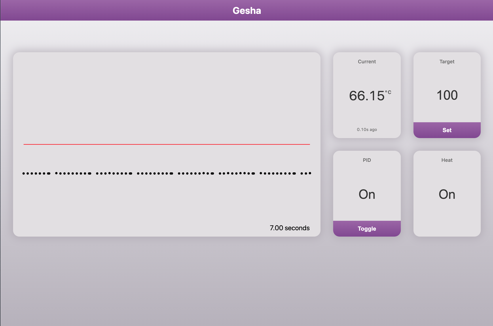

# Gesha

Gesha is a PID app for your espresso machine that uses a [MAX31855](https://www.adafruit.com/product/3328) and a solid-state relay to monitor and control the temperature of your boiler.

> My specific use case is with a Rancilio Silvia, modified roughly according to [this excellent project](https://github.com/brycesub/silvia-pi), but Gesha will work with any espresso machine with similar modifications.

## Features

- [x] Fat binary with zero dependencies
- [ ] Builds for ARM64, ARM, and AMD64
- [x] Support for Internationalization
- [x] REST API, fully documented with the OpenAPI 3 standard
- [x] Real-time streaming of temperature and PID output using lightweight [Event Streams](https://html.spec.whatwg.org/multipage/iana.html#text/event-stream)
- [x] Fast and Accessible Web UI
- [x] Add to Home Screen
- [ ] Dark Mode

## Screenshots

| Mobile                              | Tablet                              | Desktop                               |
|-------------------------------------|-------------------------------------|---------------------------------------|
|  |  |  |

## Installation

1. Download the latest [release](https://github.com/LukeChannings/gesha/releases) for your architecture
2. Move the download to your desired server and run `./gesha install`
3. Use `systemctl enable gesha` to make sure Gesha runs on boot

The install command will move the binary into `/usr/local/` and install a systemd unit.

> If you do not have a distribution that uses systemd, you can run gesha directly with `./gesha`.

## Configuration

Gesha is configured with environment variables, and an env file is also read from `/etc/gesha/config.env`.

| Env variable               | Description                                                                          | Default | Example                                                                     |
|----------------------------|--------------------------------------------------------------------------------------|---------|-----------------------------------------------------------------------------|
| PORT                       | The port the web server should run on                                                | 3000    | integer                                                                     |
| TEMPERATURE_UNIT           | The preferred temperature unit for display purposes                                  | C       | C or F                                                                      |
| BOILER_PIN                 | The pin to use to toggle the boiler on/off.                                          | GPIO7   | See [gpio-list](https://github.com/google/periph/tree/master/cmd/gpio-list) |
| SPI_PORT                   | The SPI port to use for temperature data. Empty will default to the first available. | ""      | See [spi-list](https://github.com/google/periph/tree/master/cmd/spi-list)   |
| TEMPERATURE_SAMPLE_RATE_MS | The frequency that temperature data should be sampled at                             | 100     | integer                                                                     |
| TEMPERATURE_TARGET         | The default target temperature                                                       | 100     | integer                                                                     |
| PID_FREQUENCY_MS           | The frequency with which the PID is given new temperature data and output is set     | 1000    | integer                                                                     |
| P                          | PID's Proportional variable                                                          | 2.9     | float                                                                       |
| I                          | PID's Integral variable                                                              | 0.3     | float                                                                       |
| D                          | PID's Derivative variable                                                            | 40.0    | float                                                                       |

> In case this table is out of date, all config options can be found in [config.go](./internal/config/config.go)
