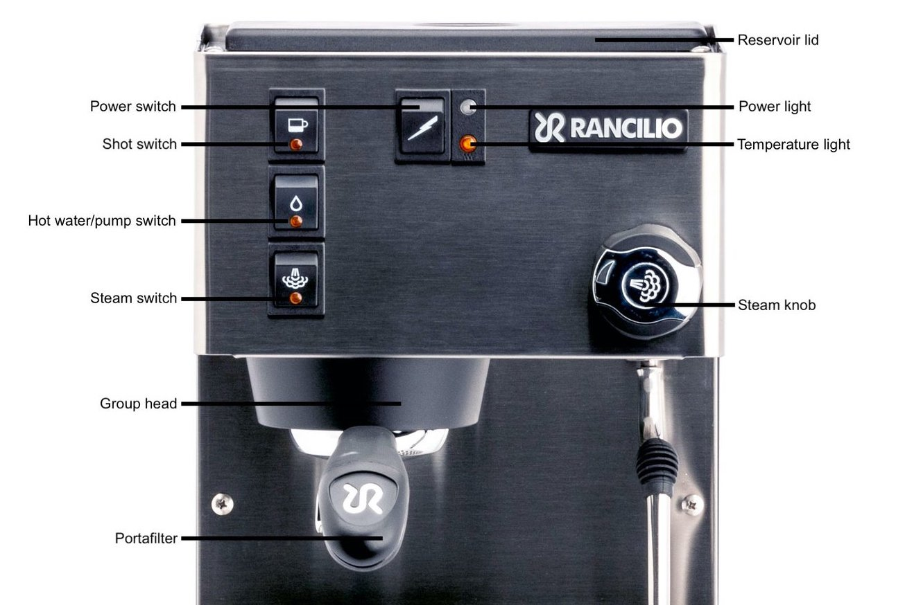
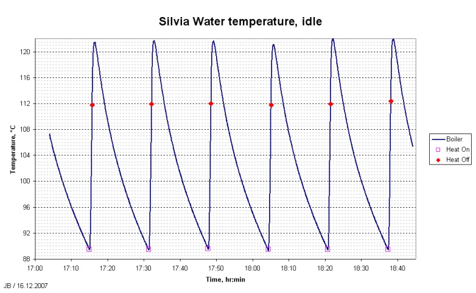
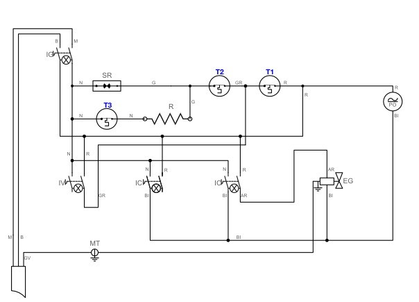
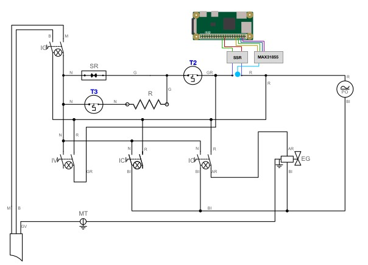

# Introduction

This project will explore the use of data analysis and predictive modelling techniques to improve extraction temperature stability in consumer-grade, semi-automatic espresso machines intended for home use.

The espresso machine used for this project will be the Rancilio Silvia E [@silvia-e-manual]. The data gathered for this project will be specific to this hardware, however, the methods and software developed will be generalisable.

I will modify the hardware as necessary to provide a platform for the software to run, this will include embedding a single board computer, temperature probes, and relay switches.

Software will enable temperature data collection for modelling, the results of which will enable real-time temperature analysis, prediction, and control, resulting in temperature performance not normally available in this product category.

I call the software **Gesha**, after the region in Ethiopia known for producing the  varietal of *Coffea arabica* of the same name. A rare and sought after cultivar.

# Background

Espresso is both a method of brewing coffee and the name of the resulting beverage.
Espresso is made by forcing hot pressurised water through a basket of finely ground coffee. The result is a concentrated and syrup-like liquid, which is often used as the base of drinks such as the Americano, Cappuccino, Cortado, etc. it is also consumed as-is.

Technical parameters for making "certified Italian espresso" are published by the Italian Espresso National Institute [@instituto-nazionale-espresso-italiano-no-date], and specify 6.5-7.5g of *ground coffee* (also called the *dose*), an *extraction temperature* &mdash; the temperature of the water at the point where it comes into contact with the ground coffee &mdash; between 86-90&deg;C, a *pressure* of 8-10 bars (101.5-130.5 psi),
*brew time* of 20-30 seconds, and an output volume of 22.5-27.5ml, which is often referred to as *yield*, and usually measured in weight (grams), not volume.

The third wave of coffee has seen a move away from traditional Italian espresso, emphasising higher standards for coffee quality and traceability [@specialty-coffee]. Lighter roasts and higher doses are now common in both home and commercial espresso.

\break

## Espresso terminology and machine mechanics

{width=90%}

An espresso machine, when powered on and "idle" (i.e. not brewing coffee) will maintain the boiler temperature using a *brew thermostat*. The brew thermostat is mounted to the boiler in order to probe its temperature. It controls whether the boiler is heating based on the temperature that it reads. In the Silvia, the brew thermostat cuts off the boiler when it reads a temperature of 100 &deg;C. In this way, the temperature of the boiler is maintained at approximately 100 &deg;C.

When the *shot switch* is in the "on", the machine is in "brewing" mode, and will activate the *vibration pump*, which pumps water from the *water tank* into the boiler. This pressurises the water within the machine.

Water flows from the boiler into the *grouphead*, which is where the *portafilter* (portable filter), which contains a *basket* of finely ground coffee is secured.
When the water exits the grouphead it hits a *shower screen*, which disperses the water evenly over the surface of the coffee basket.

Coffee ground for espresso is very finely ground, creating resistance for the pressurised water. The water will flow through more coarsely ground coffee faster than more finely ground coffee. The process of tuning the grind size is called "dialling in" the coffee.

Finely ground coffee can create high pressure in the machine, and the *over pressure valve* (OPV) connected to the boiler protects the machine from the pressure getting too high. Out of the box, most machines of this class will be set to 10-11 bars. It's common to adjust the OPV and lower the pressure to 8-9 bars.

# Problem statement

Extraction temperature has a large impact on the quality of the final cup. Increasing temperature increases the extraction of soluble compounds in the coffee, of which only 30% are water soluble [@understanding-extraction].

Espresso is normally extracted between 85-95 &deg;C. Lighter roasted beans are harder to extract, and temperatures of 90-95&deg;C are recommended [@bh-espresso-temperature-extraction]. The ability to set the extraction temperature is evidently valuable. Temperature consistency is also important, and whilst controlled temperature gradients may be desirable, uncontrolled temperature gradients make shots impossible to reproduce, and risk the temperature falling out of the narrowly defined acceptable range.

More soluble compounds are extracted at higher temperatures, as shown by Salamance et al [@salamanca2017extraction]. Extracting all 30% of solubles into the beverage would extract bad-tasting compounds that have been described as "bitter" and "papery" by Sandra Loofbourow [@understanding-extraction] - *under extracted*. Extracting fewer than soluble compounds produces a sour-tasting coffee, commonly called *under extracted*.

Unlike dose, grind size, extraction time, etc. the extraction temperature is not under the direct control of the barista. As an aside - brew pressure is also an important variable [@andueza2002influence], with pressure profiling and flow profiling being a current topic of research [@andueza2007influence]. This is a feature of higher end commercial and "prosumer" espresso machines, however, and the water pressure for our machine will be constant. Unlike pressure profiling, extraction temperature stability can be improved without expensive hardware.

{width=90%}

Given this evidence, it can be stated the the extraction temperature is a key variable in the successful extraction of high quality espresso, and fine control and observation of this variable is not possible without modification.

Temperature surfing is a technique this is often employed to help maintain some amount of temperature control, and works by timing your position on the temperature cycle (see figure 1). Without using this method, the temperature could be anywhere between 80-112 &deg;C &mdash; well outside of the acceptable range.

## Temperature surfing

Temperature surfing works by inferring the heating cycle of the boiler, it is not possible to know the true extraction temperature using this technique. In addition to its inaccuracy, it also wastes water (step 2).

An example of temperature surfing is this:

1. Let the machine heat up to temperature, allowing time for the heat from the boiler to spread to the metal frame of the machine.
2. Drain the boiling water by running the machine with no coffee, this empties the water that is potentially too hot from the boiler, bringing in cooler water from the reservoir. Wait for the heating indicator light to turn on, indicating that the boiler temperature has dropped below 100 &deg;C.
3. Wait 30 seconds after the heating light turns off, then brew your coffee.

The specific waiting period is not especially important, but it does need to be the same each time the espresso is brewed.

# Existing solutions

## PID controller

A PID (proportional-integral-derivative) controller is an algorithm that maintains a value as close to a "Set Point" (desired value) as possible, using larger adjustments the further the value is from the Set Point, and smaller and smaller adjustments as it zeroes in on the Set Point.

In our use case, the value is the current boiler temperature, and the Set Point is the desired temperature. The PID needs to be tuned to minimise overshoot, and maximise temperature stability once the system has stabilised.

There are modification kits for the Silvia, such as the Auber PID, MeCoffee, and others. This is a solution that works well, but I would like to solve the problem, using custom hardware modifications, and a machine learning approach.

### Shortcomings

PID solutions are the most common solution to the problem of temperature stability, however they have two shortcomings:

**Cost** &mdash; PID systems can cost more than the components that I will use in this project

**Thermal load factoring** &mdash; PIDs have fixed values for their coefficients, which are used to determine how aggressive or timid they are when getting to the desired temperature. The PID will maintain the value of a single variable, the *boiler* temperature, which is an insufficiently accurate proxy for the the extraction temperature.
By building a system that models the desired extraction temperature, and maintains that derived value, it may be possible to achieve better performance than a PID controller.

# Proposed solution

## 1. Model the Extraction Temperature

The extraction temperature cannot be measured directly because it would require inserting a temperature probe into the basket during extraction. This would interfere with the brewing process. The *boiler temperature* and *grouphead temperature* can be directly measured, however.

The espresso machine chassis is entirely metal, which means it has a large thermal mass. If the boiler is heated to temperature from a cold start, when brewing starts the hot water will lose some of its heat as it travels between the boiler and the grouphead, thus the thermal saturation of the machine affects the extraction temperature.

It is not possible to derive the extraction temperature from the boiler temperature directly, since the thermal saturation affects the extraction temperature.

By using the grouphead temperature as a proxy for the thermal load of the machine, it may be possible to find an approximation for the function $f(\text{BoilerTemp}, \text{GroupHeadTemp}) = \text{ExtractionTemp}$.

\break

## 2. Temperature Control System (TCS)

### Data acquisition

I will model the aforementioned function by recording the state of the machine as it runs through various scenarios: idle, heating from cold, heating from saturated, brewing, etc.

By observing different scenarios and building a dataset, I can build a predictive model that accounts for the state of the machine.

```{r, echo=F}
features <- matrix(
  c(
    "Time", "UnixEpochNs", "The current time with nanosecond resolution",
    "IsPoweredOn", "Boolean", "Whether the machine is on or off",
    "BoilerTemp", "Double", "The temperature at the boiler in celsius",
    "GroupHeadTemp", "Double", "The temperature at the grouphead in celsius",
    "IsHeating", "Boolean", "Whether the boiler is heating or not",
    "IsBrewing", "Boolean", "Whether espresso is currently being brewed - this is derived from user input"
  ),
  ncol = 3,
  byrow = TRUE
)
knitr::kable(features, col.names = c("Name", "Type", "Description"), format = "latex", booktabs = T, table.envir = "figure")
```

These features will be recorded by the software automatically, providing a large observation sample.

In addition to this, I will record the extraction temperature by building a custom portafilter basket, with a thermocouple attached (also known as a thermofilter) [@diy-thermofilter]. There are ready-made thermofilters on the market, such as the [Scace Thermofilter](https://www.espressoparts.com/products/scace-2-espresso-machine-thermofilter-temperature-pressure-device), but they are outside of my budget.

Since the temperature data will be gathered from two separate sources (the thermofilter and the SBC in the espresso machine), care will be taken to ensure the clocks on each device is in synchronisation with each other, using a time synchronisation protocol such as NTP, as both datasets will be merged together based on their *time* feature.

### Modelling the temperature

I will use the gathered data and split it into a train and test set, relying on techniques such as bagging and boosting in order to train a model. Since I'm predicting a quantitative value (the extraction temperature), I will explore linear models.

The data should be simple enough to get good results with simple linear regression. If results are poor, I may explore a small neural network.

### Control system

I will implement a Model Predictive Control [@morari1988model] (MPS) system as a starting point. MPS systems are often used in industrial applications where automation is required, but the system is non-linear, making a PID controller a less effective solution.

An MPS system can iteratively optimise a target set temperature using the predictive model to also factor in the future observed values, this allows the system to perform well with respect to negative outcomes, such as temperature overshoot.

For example, because the system can predict the lag time between the boiler being shut off and the temperature stabilising, it can more precisely time the boiler power variable. This is in contrast to a PID controller, which has no predictive power, and will simply overshoot and wait for the temperature to drop. By using a predictive model with a MPC we may be able to get the espresso machine to a ready state more quickly than a PID controller.

# Implementation

## Hardware modifications

The application will run on a Raspberry Pi Zero, a single-board computer with a 1GHz (32-bit ARMv6) CPU, and 512MB RAM.

I will modify the machine in the following ways in order to create a platform upon which I can build my application:

1. The power system will be replaced with a mechanical relay switch, such as the [Sonoff Basic](https://sonoff.tech/product/diy-smart-switches/basicr2/), or [Shelly 1](https://shellystore.co.uk/product/shelly-1/)
2. The brew thermocouple will be replaced with:
  - A type K thermocouple, driven by a [MAX31855](https://www.analog.com/media/en/technical-documentation/data-sheets/max31855.pdf) chip
  - A solid-state relay, such as the [Fotek SSR-40](https://cdn.sparkfun.com/datasheets/Components/General/SSR40DA.pdf), will replace the existing thermocouple's circuit
3. A second thermocouple and MAX31855 chip will be wired to the Pi to monitor the grouphead temperature

All of these modifications will enable me to programmatically,

- Turn off / on the machine
- Monitor the boiler and grouphead temperatures
- Turn off / on the boiler in normal brewing mode

### Wiring diagrams

Figure 3 shows the wiring diagram for the Rancilio Silvia. **T1** is the *brew thermocouple*, **T2** is the *steam thermocouple*, **T3** is the *safety (overheat) thermocouple*. These thermocouples are designed to allow current to flow when the boiler they're affixed to have reached a pre-calibrated temperature. T1 is set to 100 &deg;C (figure 1 shows a graph of the temperature on a machine with a 110 &deg;C T1 thermostat - Rancilio changed the thermostat temperature in 2001 [@silvia-idle-temp]), T2 is set to 140 &deg;C, and T3 is set to 165 &deg;C. These values are found in the Rancilio Silvia manual [@silvia-e-manual], page 51.

Figure 4 shows the changes I will make to the machine. I will replace T1 entirely, wiring its contacts to the solid-state relay. I will fix the thermocouple to the surface that T1 was previously mounted. This will enable software control of the boiler in idle and brewing modes.

The modified diagram does not show the second thermocouple, which will be attached to the grouphead, because it is not a modification to te exiting wiring.

{width=80%}

{width=80%}

\break

## Software

Because of the constraints of the hardware, I will use a modern compiled language like [Go](https://go.dev/) or [Rust](https://www.rust-lang.org/), which will perform well for embedded applications.

The application will provide an interface that provides methods for performing actions on the machine, such as:

- Turning the machine off / on. This will start the automated heating cycle.
- Getting the status (off / on) of the machine.
- Turning off / on the temperature automation mechanism - this is useful for diagnostic purposes.
- Emulating the Silvia's normal operations - again, useful for diagnostics.
- Turning off / on the heating element. The application should implement a safety system to prevent the boiler getting too hot. Note: The Silvia also has a safety thermocouple in place, but implementing our own safety measures is still good practice.
- Getting the status (off / on) of the heating element
- Getting the boiler temperature
- Getting the grouphead temperature
- Setting the desired extraction temperature

User input is required for recording when a shot is being pulled, because there is no mechanism for capturing this variable automatically without further costly modification of the machine.

I will build a web application to enable the ingestion of this user input, as well as to provide a visual interface for monitoring real-time temperature data.

A formal specification of an API is not forthcoming because the software will be interfaced with using multiple protocols. For example, in order to receive streaming temperature data, a companion app on a tablet device will be used. The temperature data may be received via bluetooth, which will provide lower latency. However, an ethernet-based system using HTTP or MQTT may also be used.

I will implement

# Project timeline

The project requires the temperature dataset in order to build a model &mdash; the first priority is implementing a mechanism to retrieve observations, which will be combined over the course of the project, hopefully making the model more accurate over time.

The tasks are as follows:

- Make the necessary hardware modifications to the machine
- Implement a lightweight command line application that can gather the necessary temperature data that will be required for predictive modelling.
- Produce a predictive model of the extraction temperature variable using the gathered boiler and grouphead temperature data, cross-referenced with basket temperature readings where available.
- Implement a full featured application server that implements a MPS controller using an initial model. This application will need to expose an interface for programmatically interactive with the machine (see the software section for a list of required features).
- Publish the source code, including documentation for the necessary hardware modifications, data, modelling code and models.
- Produce a final report on the success of the project

Many of these tasks are inter-dependent and can be done in parallel. The hardware modifications have commenced in April, and work on the data gathering CLI is under way. A sufficiently large dataset must be gathered before an effective model can be produced. I expect to implement model code in Python and periodically produce a new model as more data is gathered.

\pagebreak
