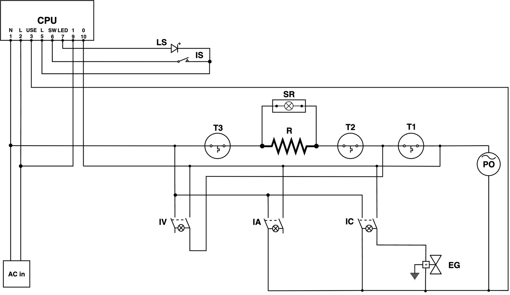
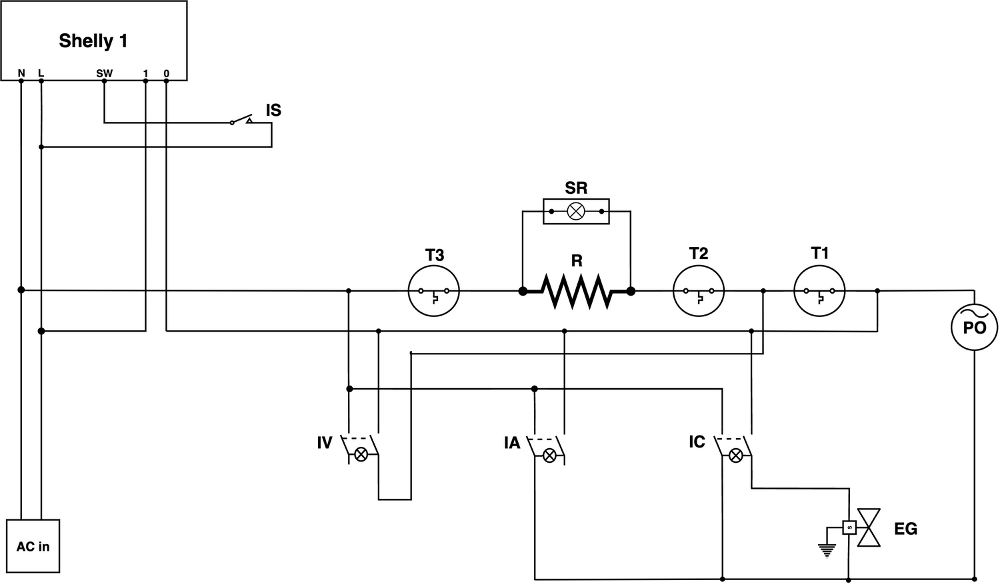
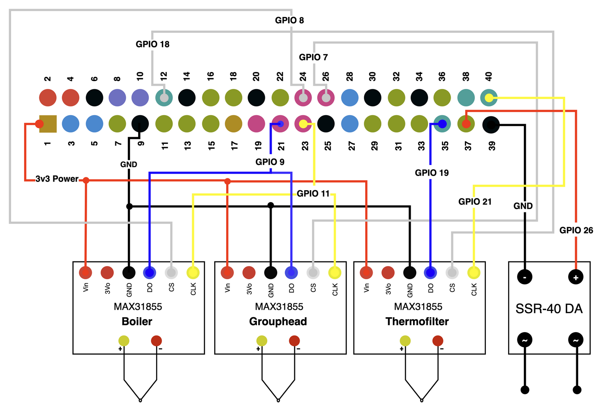
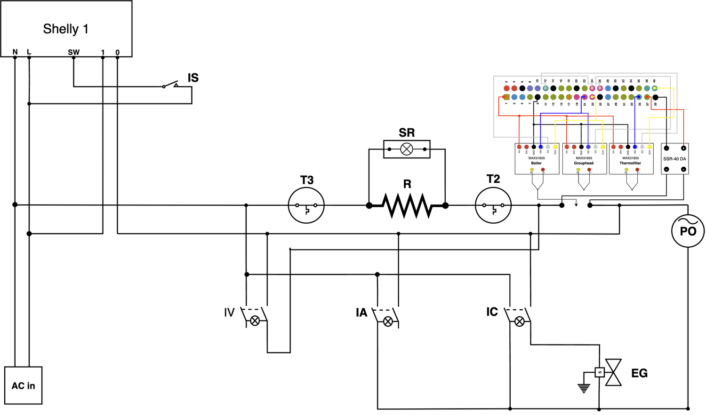

\pagebreak

# Abstract

*Extraction temperature* is an important factor in producing well balanced espresso [@andueza2003influence]. Consumer-grade semi-automatic espresso machines often use simple temperature-actuated switches as a temperature control mechanism. This produces large swings in extraction temperature. This report investigates degree of temperature variability the *Rancilio Silvia*, a popular home espresso machine.

I detail hardware modifications and develop software to aid me in gathering data to validate my temperature variability claims. I further extend the software to enable temperature control methods for comparison, including a novel predictive control method.

# Introduction

REWRITE WHEN THE OTHER SECTIONS ARE COMPLETE.

The Rancilio Silvia is an espresso machine designed for home use. It is relatively inexpensive and does not have a high-tech design.

In this report I will document the hardware modifications necessary to provide a software platform for the Rancilio Silvia.

I will present findings on the behaviour of the machine, such as its temperature variation in normal operation, the heat response for various duty cycles, and the relationship between the extraction temperature and boiler temperature when the machine is pre-heated vs not pre-heated.

I will describe the features and implementation of the Gesha software, which enables user control, customisation, and inspection of the machine's temperatures, heating, and power status.

Finally I will discuss various temperature control mechanisms, starting with the stock Threshold-based control, to PID, and finally a novel predictive model approach.

# Hardware modifications

## Rancilio Silvia

The Rancilio Silvia has two model variations, `E` model, which has an auto-off function that satisfies the European Union's idle energy use regulations and the `M` model, which omits this auto-off function. I am working with the `E` model.

As with all models, the machine can perform 3 functions:

1. Brewing coffee
2. Steaming milk
3. Dispensing hot water (through the steam wand)

### Power on

The machine is powered on when the spring-loaded power switch $IS$ is toggled. This illimunates the power light $LS$, and the CPU starts a 30 minute auto-off timer, electrifying $CPU$ pins 9 and 10. The wire coming in to $CPU$ pin 3 will be electrified whenever the machine is in use, and it will delay the auto-off timer.

As soon as the machine is powered on the boiler begins heating (see the element labelled $R$). Whilst the element is heating the heating light $SR$ will be lit. The temperature-sensitive actuator $T1$ will open when the thermocouple detects a temperature greater than 100 &deg; C - this will disable $R$ and $SR$.

### Brew

When the machine is warmed up and ready to brew the brew switch $IC$ may be toggled by the user. The water pump $PO$ pumps water from the water reservoir to the boiler. The solenoid valve $EG$ opens, creating a path for water to pass from the boiler and into the **grouphead**.

The **portafilter** containing a basket full of finely ground coffee is locked to the grouphead. The coffee provides resistance to the water which creates pressure as the pump pushes water into the boiler. The pressure forces the water the ground coffee producing espresso.

### Hot water and Steam

The $IA$ switch effectively does the same thing as the brew switch, except the solenoid valve $EG$ is not opened, meaning the hot water being pumped through the boiler goes out via the steam wand.

The $IV$ switch bypasses $T1$ $EG$ and $PO$ and heats the boiler with $T2$, which is another temperature actuated switch with a thermocouple rated to 140 &deg;C. This evaporates the water in the boiler, creating steam, which is then expelled with a manual valve release.

Aside: The third actuator $T3$ is a safety switch that will open when the boiler temperature exceeds 165 &deg; C.

## Power Relay

Before software can be written I need a platform that will provide *real-time temperature data from the boiler and the grouphead*, a mechanism to *control the heating element*, and an *optional thermofilter temperature sensor*.

Manual control over the boiler is important to our application for these reasons:

1. If the machine is always assumed to be on any state recordings we make could be invalidated. For example if we are measuring how much the temperature increases with various heat levels but the machine automatically powered off, the measurements would be invalidated because it is not possible to know when the power was shut off.
2. A feature of the software will be to programmatically run experiments like the heat measurement example above. Having no direct control of power status makes this impossible.

Due to the auto-off mechanism we cannot use an external power switch solution, we will need to modify the silvia's power system.

To solve this problem I use the Shelly 1 [@shellyrelaymanual] &mdash; a small and cheap ESP8266-based WiFi relay switch. The ESP8266 is a chipset that is supported by the ESPHome project, which is a customisable firmware for integrating ESP chipset devices with IoT infrastructure.

The configuration and instructions for flashing the Shelly switch can be found in my source code under `config/relay_switch`.

The modified layout:

- Removes the cable going to CPU pin 3, which is used to sense whether the machine is being used and delay the auto off function
- Disconnects the power LED (denoted $LS$) &mdash; a 3.3V DC LED will be wired to the Raspberry Pi instead.

The relay will connect to an MQTT broker that will enable the Gesha software to read and control the power status.

## Raspberry Pi Zero

The Raspberry Pi Zero is a single-board computer small enough to be mounted within the housing of the espresso machine itself. The System-on-chip (SoC) is the same as the original Rasbpberry Pi, it includes a 1GHz 32-bit ARM processor and 512MB of RAM. As such, it is very performance constrained.

It includes a General-purpose Input/Output interface that enables communication via SPI, I2C, UART, etc. It also supports individual pin control, which outputs 3.3V for a GPIO pin when set to high, and 0V when set to low.

The Pi is provided with power via an external USB power supply and the USB cable is routed into the espresso machine. Additionally I route an ethernet cable, which is attached to a micro-USB 100BASE-T ethernet adaptor. The version of the Pi I use does support WiFi, however due to the low-latency nature of the sensor readings I have chosen a wired network.

## $T1$ thermocouple replacement

The $T1$ thermocouple controls the temperature of the boiler during normal operation. It is a temperature-actuated switch that is afixed to the boiler in order to sense the temperature. When the switch is actuated the circuit to the heating element is complete and water will begin heating.

I replace the thermocouple and connect its inputs to Fotek SSR-40 DA Solid-State Relay (**SSR**), which can then be controlled by the Raspberry Pi.

The datasheet [@fotek-ssr-40-datasheet] states that the SSR responds within 8.3ms and is zero-crossing, meaning that the power change will only be made when the AC power waveform goes to 0.

Next, I place a type K thermocouple where $T1$ used to be on the boiler. This is attached to a MAX31855 [@max31855-datasheet] thermocouple amplifier, which is wired to the Pi's SPI0.0 interface.

The Type K thermocouple is an inexpensive thermocouple that can sense temperatures between -200 &deg;C to +1350 &deg;C. Its temperature response curve is nonlinear, however, with more temperature variability in lower temperatures.

Two wires, one made from Chromel and the other from Alumel are joined at one end and open on the other. The MAX31855 uses the different resistance between the two metals to determine the temperature at the junction using the Seebeck effect.

Because this works by passing a current through the wire, the thermocouple probe cannot touch other electrically conductive materials, and must be insulated with a silicone pad.

## Grouphead thermocouple

The grouphead temperature will be used to determine the degree to which the machine has been preheated. Placing a probe on the grouphead itself is ideal because it is the primary component that the boiler water will lose heat to.

The espresso machine front cover is disassembled, exposing the group head metal block. I place a non-conductive thermal pad on the metal and then place the thermocouple on top of that. I secure the thermocouple in place with a high temperature polyimide film adhesive.

Once again the Type K thermocouple is attached to a second MAX31855 adaptor, attached to the Pi on the SPI0.1 interface.

## Thermofilter

In order to gather data about the temperature difference between the boiler, grouphead, and the extraction water, I have devised a thermocouple that can be attached to a *portafilter* to create a device called a *thermofilter*.

This device starts with a blanking basket &mdash; usually used for backflushing a cleaning agent into the machine &mdash; with a large hole drilled off-centre to allow the thermocouple probe to be threaded through. A second, smaller hole, is drilled in the centre of the basket, this is to allow water to flow through the thermofilter.

Lastly the device is filled with a epoxy resin, which will harden to hold the thermocouple probe in place.

The thermofilter will not be used in the normal operation of the Silvia - it's only used to gather temperature data for the predictive model. As such the thermofilter is connected to a type k thermocouple connector, which is in turn connected to a third MAX31855 amplifier, which is connected to the Pi's SPI1.0 interface.

## Wiring

Figure 5 shows the final wiring for the 3 MAX31855 adaptors and the SSR. The MAX31855 devices share the same Power and Ground wires.

The Pi's SPI0 interface has 2 *Chip Select*s, meaning at most two MAX31855s to be wired to that interface. The third MAX31855 belongs to the thermofilter, and is wired to the SPI1 interface. The SPI1 interface is explicitly enabled using an overlay. See the `config/raspberry_pi/boot/config.txt` file in the source code for the exact configuration.

The SSR is connected to GPIO 26.

This concludes the hardware modifications that have been made to the machine. I now have a hardware platform that will enable me to read the *boiler*, *grouphead*, and *thermofilter* temperatures, as well as to toggle the heating element.

\pagebreak

# Gesha Software

Gesha is the name of the software service that will provide an API for controlling the temperature, as well as real-time temperature data.

## Supporting services

### MQTT broker

The chosen transport protocol for Gesha is [MQTT](https://mqtt.org/mqtt-specification/). Alternatives considered were HTTP/REST.

MQTT is a topic-based publisher-subscriber asynchronous messaging protocol. An MQTT service is called a *broker*. I have chosen the Eclipse Mosquitto [@mosquitto2018eclipse] broker because it is high performance and lightweight, as such it can run comfortably on the Pi's performance constrained hardware.

MQTT was chosen for the following key reasons:

1. The application requires real-time streaming of sensor data
2. The application must respond in real time to state changes in the relay switch
3. MQTT is a commonly used and well supported protocol in IoT devices.
4. Using MQTT allows simple integration into automation tools like Node-RED [@node-red], and home hub platforms like Home Assistant [@home-assistant].

It is possible to fulfil these requirements using Web Platform techniques such as [Webhooks](https://en.wikipedia.org/wiki/Webhook) and [Server Sent Events](https://html.spec.whatwg.org/multipage/server-sent-events.html). However, MQTT is simpler and provides better ergonomics for asynchronous APIs. In addition because any MQTT client can observe events this makes observability of the system, and thus debugging, easier.

Configuration of the the MQTT broker can be found in `config/raspberry_pi/etc/mosquitto`.

### HTTP server

Gesha provides a Web Application using modern front-end tooling such as TypeScript, SolidJS, d3 for charts, and mqtt.js for communicating with the Gesha service.

The Web Application is bundled into HTML, Javascript, and CSS files which must be served over HTTP using an HTTP server.

Whilst there are many suitable Rust-based web servers such as Warp and Rocket, I chose to use Nginx to serve the web application in order to keep the Gesha service simple.

## MQTT API

The MQTT broker allows clients to broadcast messages on a *topic*, and to *subscribe* to a topic to be notified when a message has been broadcast. This is referred to as the *Publish-Subscribe* pattern. This is unlike HTTP, which has a single *client* and a *server* for each *request* and *response*, MQTT may have multiple connected clients listening to multiple topics.

Messages may be published using two options - the *Quality of Service* (QoS) which deals with the level of reliability to be expected when publishing a message.

There are 3 levels:

- At most once (QoS 0)
- At least once (QoS 1)
- Exactly once (QoS 2)

The second option is *Retain*, which determines whether the MQTT broker should drop the message once it has been broadcast to subscribers, or if it should keep the message and rebroadcast it to new subscribers.

The root topic for Gesha is `gesha/`. If a client subscribed to the `gesha/#` topic, it would receive all messages that are published to topics starting with `gesha/`.

### `gesha/mode`

### `gesha/temperature/#`

|Topic|Unit|Type|QoS|Retain|
|-|-|-|-|-|-|
|`gesha/temperature/boiler`|&deg; C|String|QoS 1|Yes|
|`gesha/temperature/grouphead`|&deg; C|String|QoS 1|Yes|
|`gesha/temperature/thermofilter`|&deg; C|String|QoS 1|Yes|
|`gesha/temperature/target`|&deg; C|String|QoS 1|Yes|
|`gesha/temperature/target/set`|&deg; C|String|QoS 2|No|
|`gesha/temperature/last_updated`|UNIX Epoch (millis)|String|QoS 1|Yes|

Topics that end in **`/set`** may be used by clients to tell the Gesha service to change its behaviour. If the `/set` is successful the requested value will be reflected on the topic without the `/set`.

For example `gesha/temperature/target` indicates the target temperature that Gesha is using. If a client publishes a message on the `gesha/temperature/target/set` topic with a payload of `"90.5"`, when Gesha receives this message and processes it, it will publish the new internal target temperature on the `gesha/temperature/target`.
